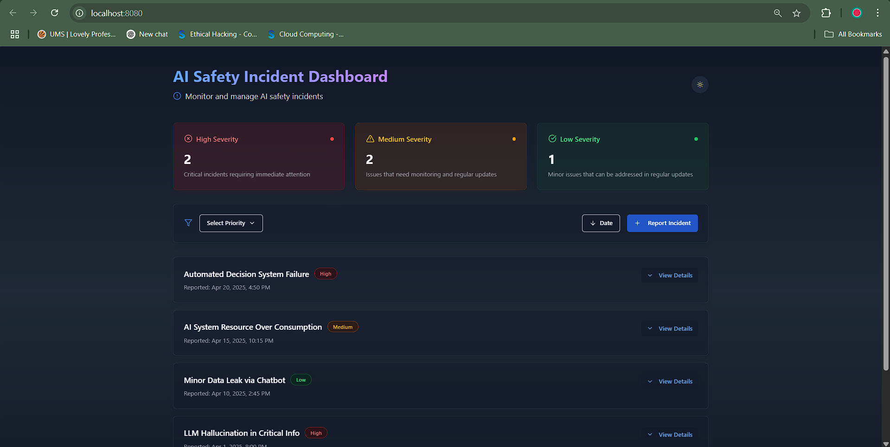
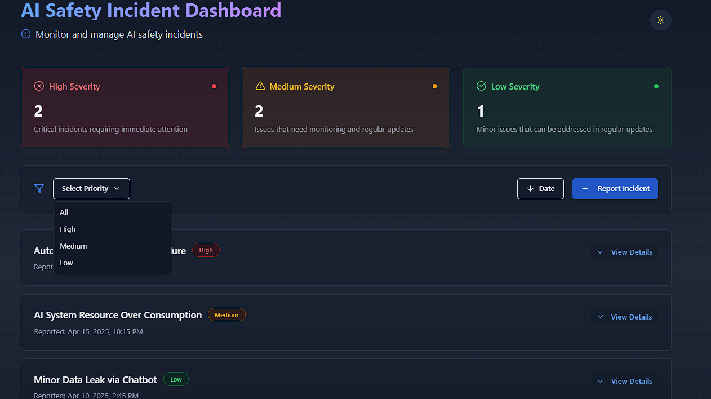
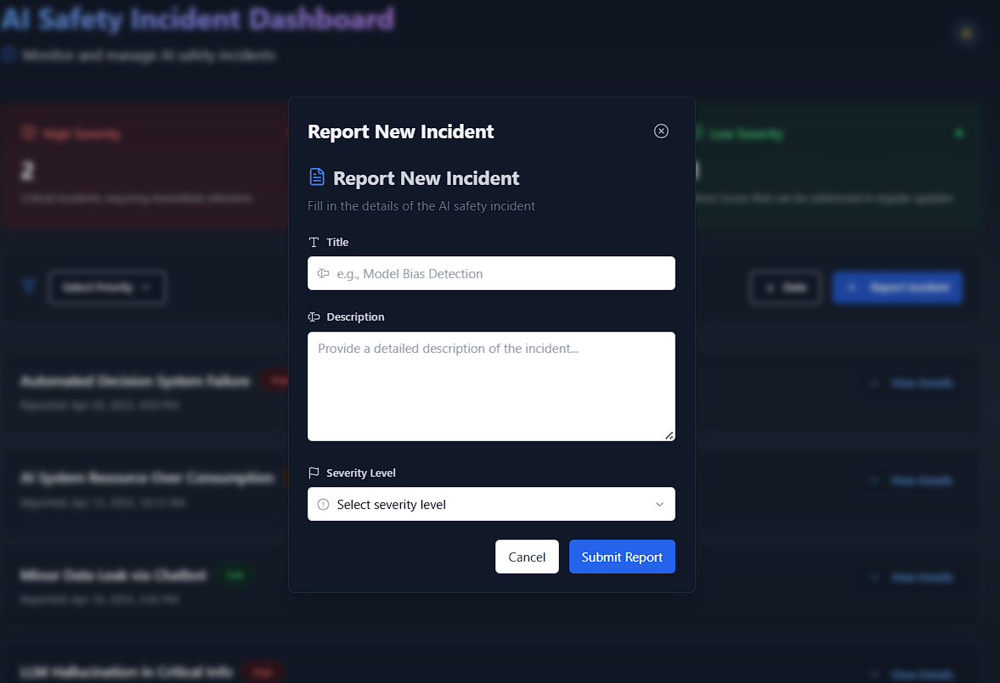

# AI Safety Incident Dashboard

### Deployed Link: https://job-hunt-one-kappa.vercel.app/
### GitHub Link: https://github.com/vineetkrsingh769/ai-safety-dashboard-ui

## 🚀 Project Description

This project is a **Frontend Take-Home Assignment** for an AI Safety Startup (HumanChain).  
It is a **ReactJS** based interactive **AI Safety Incident Dashboard** that allows users to:

- **View** a list of AI safety incidents (with Title, Severity, and Reported Date).
- **Filter** incidents by Severity: High, Medium, Low.
- **Sort** incidents by Reported Date (Newest First / Oldest First).
- **Expand/Collapse** incident details with a "View Details" button.
- **Report New Incidents** using a form with validation.
- **Manage state locally** without any backend (all data is session-based).

The dashboard is styled with a clean, responsive design using modern layout techniques 

---

## 📸 Screenshots

### Dashboard Overview


### Filtering and Sorting


### Incident Reporting Form



---

## 🧩 Features

- ✅ Display AI Safety Incidents list.
- ✅ Filter incidents by severity (High, Medium, Low).
- ✅ Sort incidents by Reported Date.
- ✅ Toggle incident details with "View Details."
- ✅ Add new incident through a validated form.
- ✅ Fully responsive and accessible design.

---
## Installation and Setup

Follow these steps to set up the project locally:

### Prerequisites

- Node.js and npm should be installed on your system.

### Steps

```bash
# Clone the repository
git clone https://github.com/vineetkrsingh769/JobHunt_.git

# Navigate into the project directory
cd Jobringer

# Install dependencies
npm install

# Run the development server
npm run dev
